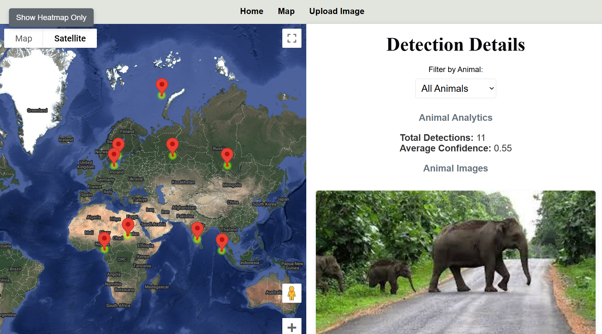
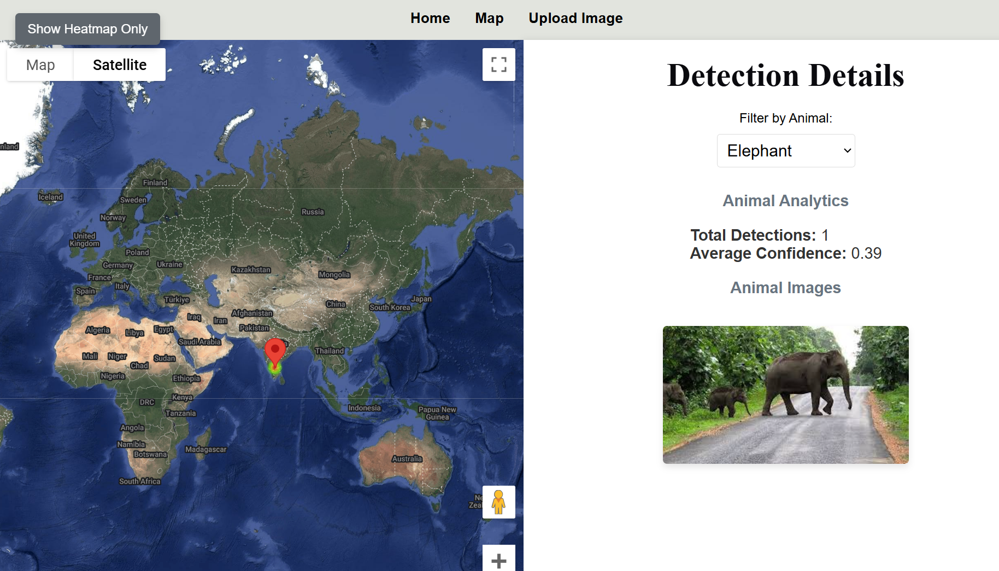
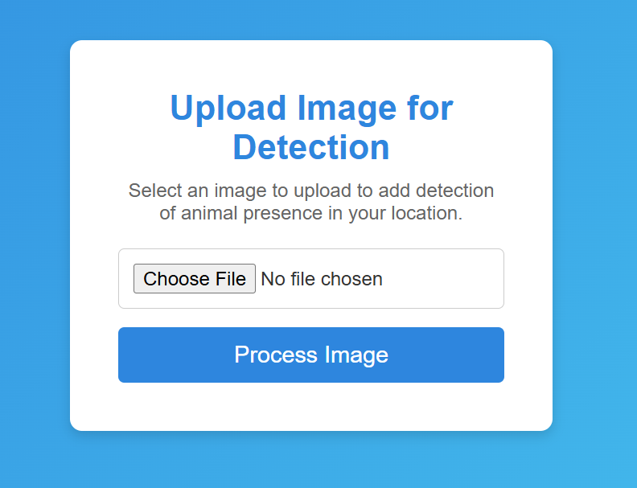

# Animal Detection and Protection System

## Overview

The Animal Detection and Protection System is designed to ensure wildlife safety, particularly on highways, by using advanced computer vision techniques like YOLO (You Only Look Once) for real-time object detection. The system aims to monitor animal movement on roads and trigger sound alerts (such as tiger roars) to warn animals away from high-traffic areas. It also records animal detections, displaying them on a map with analytics for better decision-making and community-driven reporting.

## Features

- **Real-time Animal Detection**: The system uses YOLO to detect various wildlife species in real-time.
- **Sound Alerts**: Animal-specific sound alerts (e.g., tiger roars) are triggered to deter animals from high-risk areas.
- **Heatmap Visualization**: Heatmaps show where most animal detections occur, helping authorities understand and manage the situation better.
- **Web Interface**: A user-friendly web interface displays the map, detection details, animal images, and analytics.
- **Community Reporting**: Community members can report animal sightings to contribute to the data, enhancing system accuracy and coverage.
- **Edge Device Deployment**: The system is designed to be lightweight, allowing it to run on edge devices in remote or highway areas.

## Installation

### Prerequisites

Ensure you have the following software installed:

- Python 3.x
- Node.js
- MongoDB (for the backend database)
- yolo
- FastAPI (for backend API)

## Usage
- **Uploading an Image for Detection**: Users can upload an image of the road or wildlife area, and the system will process the image to detect animals using the YOLO model.

- **Viewing Animal Detections on the Map**: The map displays markers for each animal detection along with the detection details. You can toggle the heatmap view to see areas with higher detection frequencies.

- **Community Reporting**: Users can submit sightings of animals on roads to the database, which helps increase the system's accuracy.

- **Analytics**: The system provides analytics about detection counts, average confidence scores, and other metrics related to wildlife movements.

